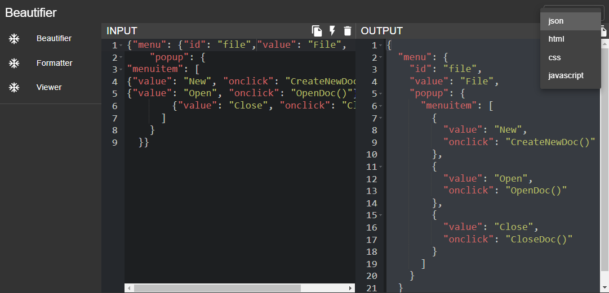
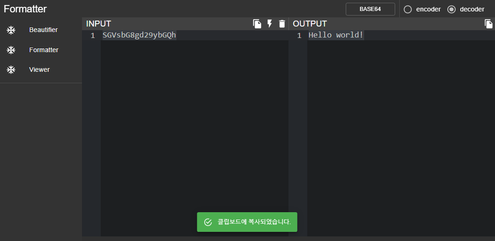
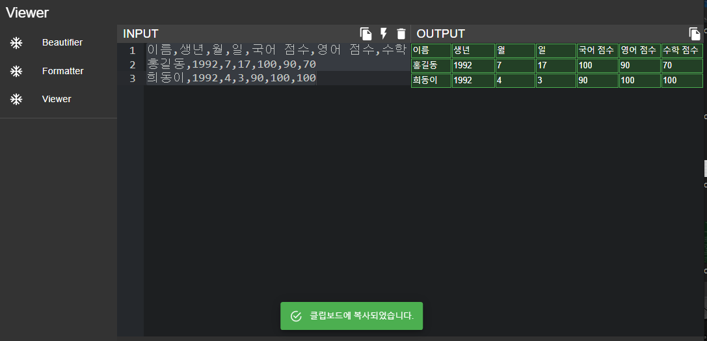

# DevTools

개발 보조도구 모음

## 주요 기능

- Beautifier  // code Beautifier
  - json
  - html
  - css
  - javascript
- Formatter  // 포멧 변경
  - BASE64 (encoder/decoder)
- Viewer  // 뷰어
  - CSV to CELL  (spreadsheet 복사용도)

## 빌드 방법

Dev

```
npm run start
```

Generate Setup.exe

```bash
# build
npm run build
# dist (setup.exe)
npm run dist
```

## 스크린샷



[Formatter Sample - encoder]



[Viewer Sample]


> This project was bootstrapped with [Create React App](https://github.com/facebook/create-react-app).
